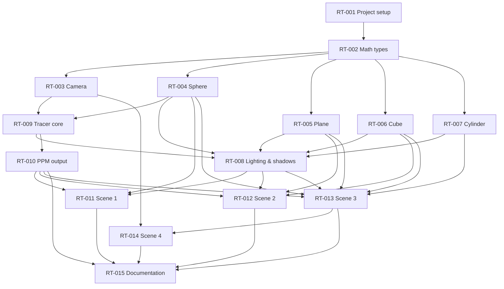
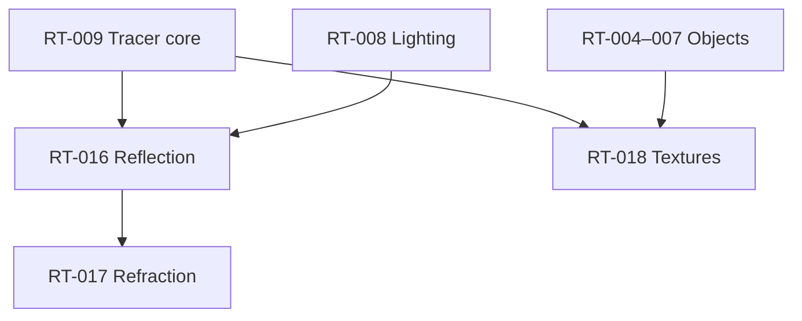

# Ticket dependency map

Read this before picking work from the board. An arrow **A → B** means: **finish A before starting B** (or at least its blocking parts).

---

## Visual map (mandatory path)



## Bonus track (optional, after core)



---

## Phases (recommended order)

| Phase | Tickets | Who can work in parallel |
|-------|---------|--------------------------|
| **0 — Bootstrap** | RT-001 | 1 person |
| **1 — Foundation** | RT-002 | 1 person (others review or skim docs) |
| **2 — Parallel core** | RT-003, RT-004, RT-005, RT-006, RT-007 | Up to **3 people** (one camera + two objects, or split all four objects) |
| **3 — Integration** | RT-009 | 1 person (define `Hittable` trait first so objects plug in) |
| **4 — Shading & I/O** | RT-008, RT-010 | 2 people in parallel |
| **5 — Scenes** | RT-011, RT-012, RT-013 | Up to **3 people** (one scene each) |
| **6 — Final scene & docs** | RT-014, RT-015 | 2 people |
| **7 — Bonus** | RT-016, RT-017, RT-018 | Any time after phase 4 |

---

## Per-ticket: blocked by → unlocks

| Ticket | Blocked by (must be done first) | Unlocks (can start after) |
|--------|----------------------------------|---------------------------|
| **RT-001** | — | RT-002, RT-003, RT-004–007 |
| **RT-002** | RT-001 | RT-003, RT-004, RT-005, RT-006, RT-007, RT-009 |
| **RT-003** | RT-002 | RT-009, RT-014 |
| **RT-004** | RT-002 *(RT-009 trait stub OK in parallel)* | RT-009, RT-008, RT-011, RT-013, RT-018 |
| **RT-005** | RT-002 | RT-008, RT-012, RT-013, RT-018 |
| **RT-006** | RT-002 | RT-008, RT-012, RT-013, RT-018 |
| **RT-007** | RT-002 | RT-008, RT-013, RT-018 |
| **RT-009** | RT-002, RT-003, **≥1 object** (RT-004+) | RT-008, RT-010, RT-016, RT-018 |
| **RT-008** | RT-009, RT-004–007 | RT-011, RT-012, RT-013, RT-014, RT-016 |
| **RT-010** | RT-009 | RT-011, RT-012, RT-013, RT-014, RT-015 |
| **RT-011** | RT-004, RT-008, RT-010 | RT-015 |
| **RT-012** | RT-005, RT-006, RT-008, RT-010 | RT-015 |
| **RT-013** | RT-004–007, RT-008, RT-010 | RT-014, RT-015 |
| **RT-014** | RT-003, RT-013 | RT-015 |
| **RT-015** | RT-010–014 *(draft earlier OK)* | — |
| **RT-016** | RT-008, RT-009 | RT-017 |
| **RT-017** | RT-009, RT-016 *(recommended)* | — |
| **RT-018** | RT-004–007, RT-009 | — |

---

## What each person can pick **right now**

Assuming nothing is done yet:

| After completing… | Safe next tickets |
|-------------------|-------------------|
| Nothing | **RT-001** only |
| RT-001 | **RT-002** |
| RT-002 | **RT-003**, **RT-004**, **RT-005**, **RT-006**, **RT-007** (any split) |
| RT-002 + RT-003 + ≥1 object | **RT-009** |
| RT-009 + all objects | **RT-008**, **RT-010** |
| RT-008 + RT-010 + sphere | **RT-011** |
| RT-008 + RT-010 + plane + cube | **RT-012** |
| RT-008 + RT-010 + all objects | **RT-013** |
| RT-013 + camera | **RT-014** |
| RT-010–014 | **RT-015** (finalize) |

---

## Critical path (longest chain)

Minimum sequence if one person did everything:

```
RT-001 → RT-002 → RT-004 → RT-009 → RT-008 → RT-010 → RT-013 → RT-014 → RT-015
```

With 3 people, shorten calendar time by running **RT-003–007** together after RT-002, then **RT-008 + RT-010** together after RT-009.

---

## Parallel work example (team)

| Person | Week 1 | Week 2 | Week 3 |
|--------|--------|--------|--------|
| **Iana** | RT-001 → RT-002 → RT-009 | RT-010 | RT-018 (bonus) |
| **Sofia** | *(after RT-002)* RT-004 → RT-006, RT-003 | RT-005 → RT-007 | RT-017 (bonus) |
| **Andriana** | RT-015 outline | RT-008 → RT-011 | RT-012 → RT-013 → RT-014 → RT-015 |

**Now:** Iana has **RT-001** in progress. Sofia and Andriana pick up work after RT-002 and RT-009 respectively.

---

## Notes

- **RT-004 vs RT-009:** Objects can be built before the full tracer if the team agrees on a `Hittable` trait signature early (stub in `objects/mod.rs`).
- **RT-008 vs RT-009:** Tracer core should find hits first; lighting/shadows plug into `trace()` afterward.
- **RT-015:** Start a doc outline anytime after RT-001; fill examples once scenes exist.
